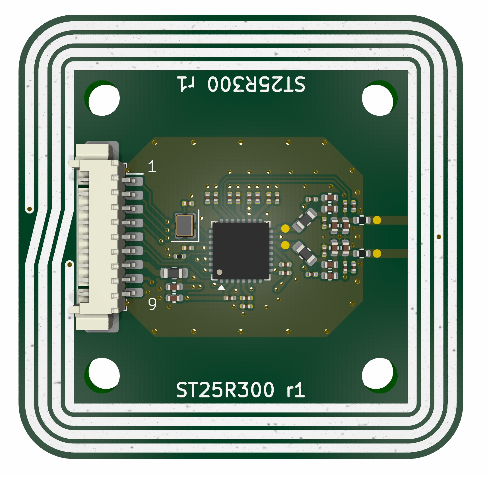

# ST25R300-reader — NFC Reader Board

A compact, high-power NFC reader module built around the STMicroelectronics ST25R300 series. Packed into a 40x40mm board, it drives an onboard 4-turn center-tapped PCB antenna at up to 2.2 W, giving 4+ cm read range across a wide variety of tag form factors — including hard-to-read rings.

## Features

- NFC-A/B (ISO14443A/B), NFC-F (FeliCa), NFC-V (ISO15693, up to 212 kbps) support
- NFC initiator, target, reader, and card emulation modes; EMVCo PCD 3.2a compliant analog/digital
- Low-power card detection (LPCD) via I/Q antenna signal measurement
- Up to 2.2 W RF output power (extended range capable)
- 4+ cm read range across various tag form factors, including rings
- Dual supply: 5 V antenna/RF rail, separate IO supply
- Compact 40x40mm board

## The ST25R300 Chip

The ST25R300 is STMicroelectronics' high-performance NFC universal reader/transceiver IC. It supports NFC-A/B (ISO14443A/B), NFC-F (FeliCa), and NFC-V (ISO15693) protocols, and can operate as an NFC initiator, target, reader, or card emulator. It is designed to be compliant with the EMVCo PCD 3.2a analog and digital standards, making it suitable for contactless payment reader designs as well as general NFC/RFID applications.

- Manufacturer: STMicroelectronics
- Part: ST25R300-AQET
- Package: 32-pin UFQFPN-EP
- Datasheet/product page: https://www.st.com/en/nfc/st25r300.html
- Host interface: SPI
- Operating frequency: 13.56 MHz carrier (max 27.12 MHz internal)
- Supply range: wide supply voltage range 2.7 to 6.0 V (VDD); wide peripheral communication supply range 1.65 to 5.5 V (IO)
- Operating temperature: -40°C to +105°C
- RF output power: up to 2.2 W (extended range)
- Key features: low-power card detection (LPCD) using I/Q antenna signal measurement; NFC-A/NFC-F card emulation

## Board Specifications

| Spec | Value |
|---|---|
| Supply voltage | Dual rail: VTX 5 V antenna/RF supply; VIO host-provided IO supply (1.65–5.5 V) |
| Read range | 4+ cm, tested across various tag form factors including rings |
| Antenna tuning | Tuned to 15 Ω |
| Current consumption | ~0.25 A @ 5V|
| Operating temperature | -40°C to +105°C (chip rating — confirm board components match) |
| Dimensions | 40 x 40 mm |
| Antenna | Onboard PCB trace antenna, 4 turns, center-tapped |
| Host interface | SPI |

## Pinout

Connector: Molex PicoBlade 53261-0971, 1x9, 1.25mm pitch (`Conn_01x09`)

| Pin | Signal | Type | Description |
|---|---|---|---|
| 1 | CS | Input | SPI chip select (active low) |
| 2 | MOSI | Input | SPI master out / slave in |
| 3 | SCLK | Input | SPI clock |
| 4 | MISO | Output | SPI master in / slave out |
| 5 | RST | Input | Reset (optional — pulled down on-board; drive high to release reset) |
| 6 | IRQ | Output | Interrupt output |
| 7 | VTX | Power | Antenna/RF supply (5 V) |
| 8 | VIO | Power | IO supply (host-provided, 1.65–5.5 V) |
| 9 | GND | Power | Ground |

Signal directions in the table above are from the module's perspective: host → board for inputs, board → host for outputs.

## Connector

On-board connector: Molex PicoBlade, 1.25mm pitch, 1x9 position (53261-0971).

## Mechanical

| Spec | Value |
|---|---|
| Board dimensions | 40 x 40 mm |
| Mounting holes | 4x M3 (3.2 mm drill) on a 25 x 25 mm grid |
| Board thickness | 1.2 mm |
| Layer count | 4 |

Any metal near the antenna will detune the frequency and reduce read range/performance. Keep the antenna area clear of screws, connectors, enclosures, and other conductive objects. Use nylon screws for mounting to avoid affecting the antenna.

## How to Use

Firmware and host driver code are not provided with this board. To get started integrating the ST25R300, refer to the following repositories:

- [JohnMcLear/esphome_st25r](https://github.com/JohnMcLear/esphome_st25r) — ESPHome component for the ST25R300 NFC reader

## Certifications and Compliance

This board is **not certified** for regulatory or payment-scheme compliance. It is intended for **evaluation, development, and prototyping only**. While the ST25R300 IC is EMVCo PCD 3.2a analog/digital compliant, the assembled board has not undergone EMVCo, FCC, CE, or other required certifications. Do not use it in a production or end-user product without completing the appropriate testing and certification for your jurisdiction and application.

## Warnings

> **Hot!** The damping resistors connecting the antenna trace to the NFC reader reach approximately 80°C during operation. Over time this heats up the surrounding board area as well. Be cautious when touching the board during or shortly after use.

## Known Issues / Next Revision (R3) TODO

Nothing yet...

## License

Hardware design files in this repository are licensed under the **CERN Open Hardware Licence Version 2 - Weakly Reciprocal (CERN-OHL-W-2.0)**.

See [LICENSE](LICENSE) for the full license text.